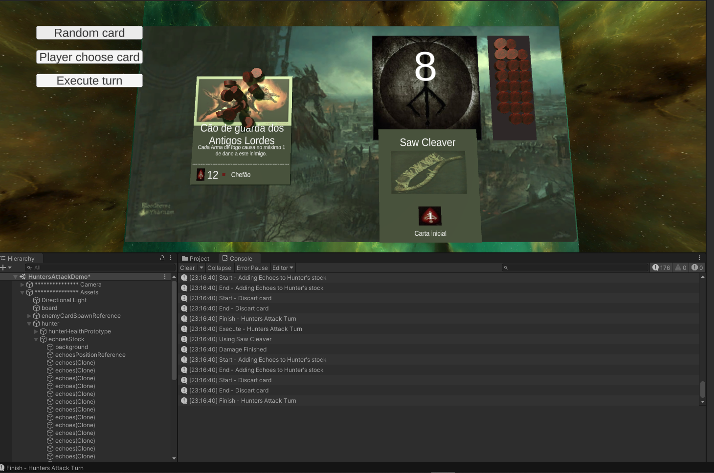
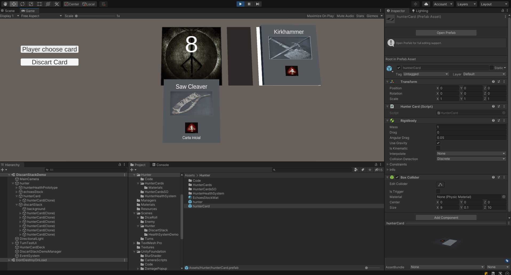

# bloodborne-enter-the-dungeon
Reimaginação do jogo de cartas do Bloodborne para uma aventura sombria e cruel para os calabouços do império Pthumeriano.

# Dev Logs

- Dia ?? (Já tem alguns dias que estou mexendo)

Criação do turno de Ataque dos Caçadores

Agora já é possível escolher uma carta do caçador para infringir dano no monstro, também foi criado o sistema de estoque de echoes.

- Dia 3

Criação do sistema de pilha das cartas descartadas

Para cada carta utilizada pelo caçador, quando este já foi utilizada ela vai direto para a pilha de descarte

